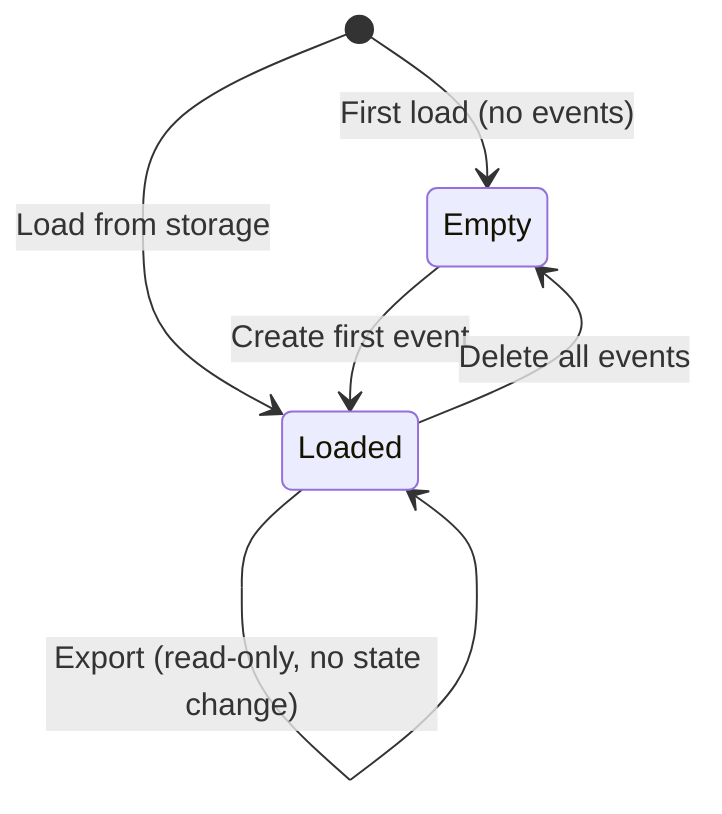
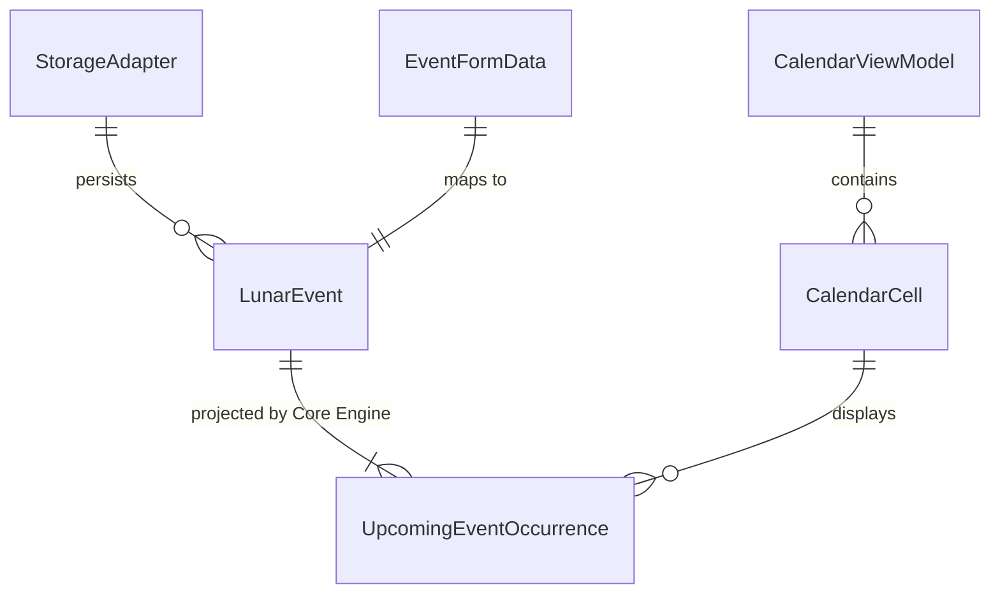

# Data Model: Lunar Event Manager UI

**Feature**: 002-lunar-event-ui  
**Date**: 2026-02-22  

## Core Engine Types (Frozen — Read Only)

These types are defined in `src/core/models/types.ts` and MUST NOT be modified by the UI layer.

| Type | Fields | Source |
|------|--------|--------|
| `LunarDate` | `day: number`, `month: number` | Core Engine |
| `SolarDate` | `year: number`, `month: number`, `day: number` | Core Engine |
| `LeapMonthRule` | `REGULAR_ONLY`, `LEAP_ONLY`, `BOTH` | Core Engine |
| `LunarEvent` | `id`, `name`, `lunarDate`, `leapMonthRule`, `createdAt`, `updatedAt` | Core Engine |
| `UpcomingEventOccurrence` | `event`, `solarDate`, `isLeapMonthOccurrence`, `daysUntil` | Core Engine |
| `ExportPayload` | `version`, `exportedAt`, `events` | Core Engine |

## UI Layer Types (New)

### StorageAdapter Interface

```typescript
interface StorageAdapter {
  load(): LunarEvent[];
  save(events: LunarEvent[]): void;
}
```

**Purpose**: Abstracts persistence. Core Engine operates on pure arrays; the adapter bridges to localStorage.  
**Validation**: None at the adapter level — validation happens via Core Engine API before save.  

### CalendarCell

```typescript
type CalendarCell = {
  date: SolarDate;
  isCurrentMonth: boolean;
  isToday: boolean;
  events: UpcomingEventOccurrence[];
};
```

**Purpose**: View model for a single cell in the monthly calendar grid.  
**Computed from**: Core Engine occurrence output + current date.  

### CalendarViewModel

```typescript
type CalendarViewModel = {
  year: number;
  month: number;
  cells: CalendarCell[];
  monthLabel: string;
};
```

**Purpose**: Complete view model for a rendered monthly calendar.  
**Invariant**: `cells.length` is always a multiple of 7 (padded with previous/next month days).  

### EventFormData

```typescript
type EventFormData = {
  name: string;
  lunarDay: number;
  lunarMonth: number;
  leapMonthRule: LeapMonthRule;
};
```

**Purpose**: DTO for the create/edit form. Mapped to `LunarEvent` on save by generating `id`, `createdAt`, `updatedAt`.  
**Validation**: Delegated entirely to Core Engine validation API.  

## State Transitions



## Relationships


